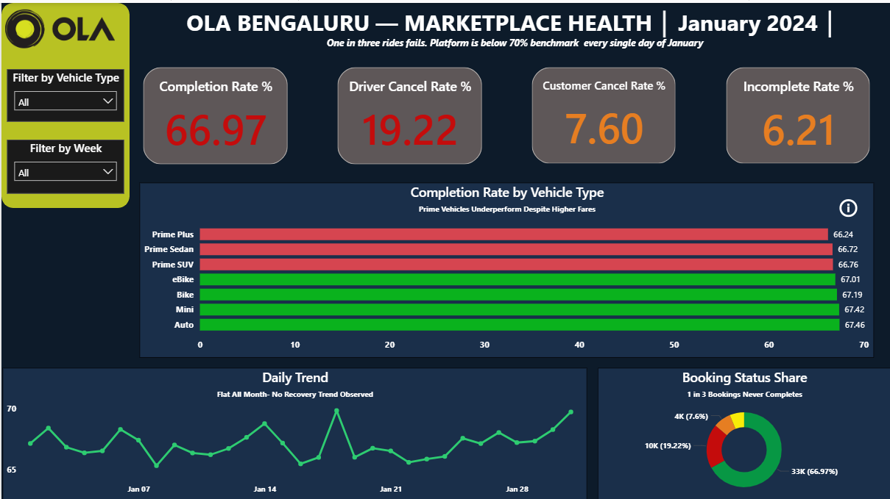
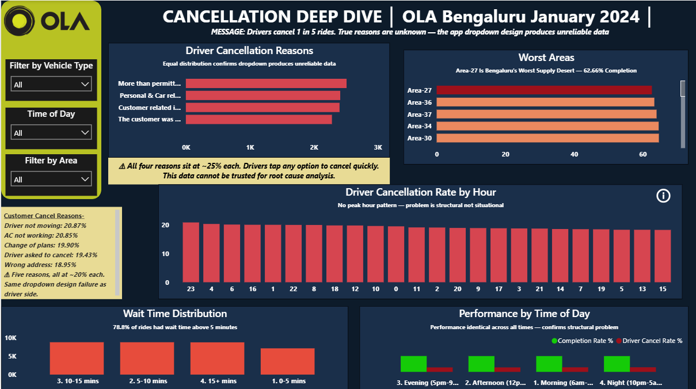
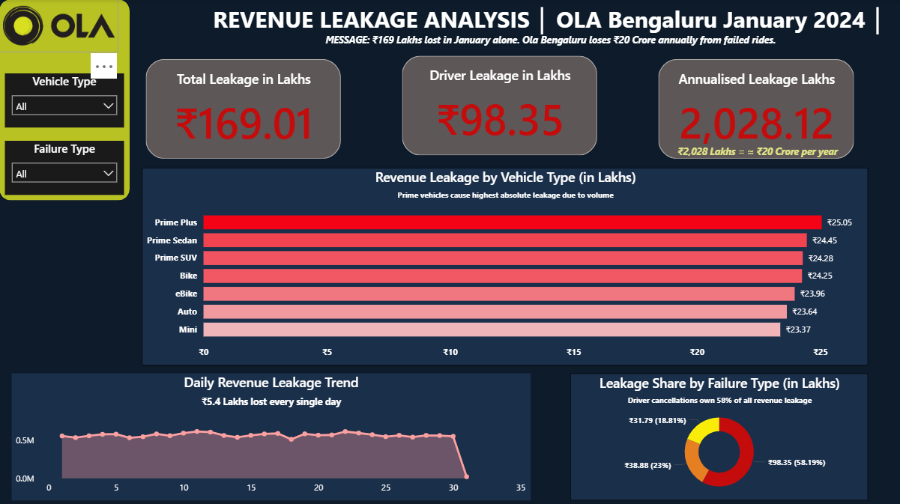
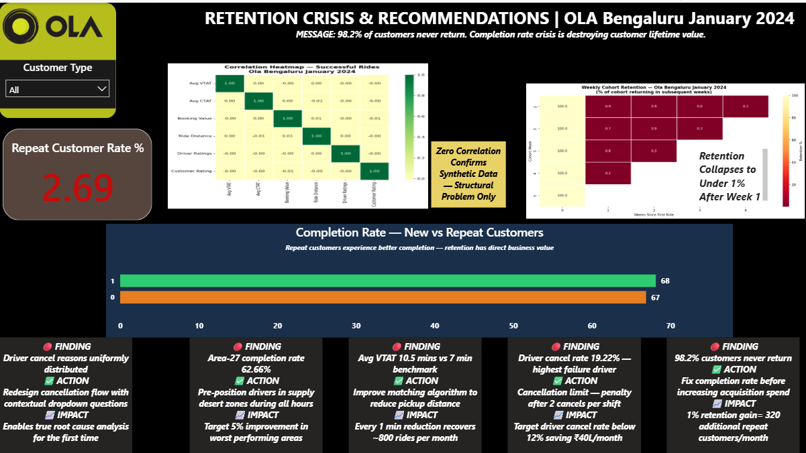

# 🚖 Ola Bengaluru — Product Analytics Case Study

## 📌 Project Overview

This project is a complete end-to-end product analytics case study on Ola's 
ride-hailing operations in Bengaluru for January 2024. The analysis identifies 
why 1 in 3 rides fails to complete, quantifies the revenue impact, and provides 
actionable product recommendations.

**Tools Used:** MySQL | Python | Power BI  
**Dataset:** Ola Bengaluru Rides — January 2024 (49,999 records)  
**Role Simulated:** Product Analyst — Bengaluru City Operations

---

## 🎯 Business Problem

Ola Bengaluru's ride completion rate fell to **66.97%** in January 2024, 
below the internal benchmark of 70%. The Head of Growth requested a full 
diagnostic to identify root causes, quantify revenue leakage, and recommend 
product interventions before the next sprint.

**Stakeholders:**
- Head of Product
- Growth Team
- Driver Operations
- City Operations Manager
- Finance Team

---

## 📊 Dataset Description

| Property | Detail |
|---|---|
| Source | Kaggle — Ola Bengaluru Rides Dataset |
| Records | 49,999 rides |
| Time Period | January 2024 |
| City | Bengaluru |
| Columns | 21 raw → 30 after feature engineering |

**Important Note:** This dataset is synthetic in nature. Uniform distributions 
in categorical variables and zero correlations between numeric variables confirm 
artificial generation. All structural findings are valid for analytical 
demonstration. Variable-level correlations and reason-based analysis are 
illustrative only.

---

## 🔍 Key Findings

### Finding 1 — Ride Completion Crisis
- Only **66.97%** of rides complete successfully
- **1 in 3 rides fails** — below the 70% internal benchmark
- Problem is chronic — completion rate flat across all 31 days of January

### Finding 2 — Driver Cancellations Are the Primary Problem
- Driver cancellation rate: **19.22%** (benchmark: below 15%)
- Driver cancellations alone cost **₹98.35 Lakhs** in January
- Premium vehicles (Prime Plus, Prime Sedan, Prime SUV) have the worst 
  completion rates despite commanding similar fares

### Finding 3 — Revenue Leakage at Scale
| Failure Type | Failed Rides | Revenue Lost |
|---|---|---|
| Driver Cancellations | 9,610 | ₹98.35 Lakhs |
| Customer Cancellations | 3,799 | ₹38.88 Lakhs |
| Incomplete Rides | 3,106 | ₹31.79 Lakhs |
| **Total** | **16,515** | **₹169.02 Lakhs** |

**Annualised leakage: ₹2,028 Lakhs (≈ ₹20 Crore) from Bengaluru alone**

### Finding 4 — Broken Data Collection Mechanism
- Driver cancellation reasons are distributed perfectly evenly at ~25% each 
  across 4 options
- Customer cancellation reasons distributed at ~20% each across 5 options
- This uniform distribution is statistically impossible in real behaviour
- **Conclusion:** The Ola app forces dropdown selection with no free text — 
  producing unreliable cancellation data that cannot be used for root cause 
  analysis

### Finding 5 — Wait Time Crisis
- Average VTAT: **10.5 minutes** (healthy benchmark: under 7 minutes)
- **78.8% of successful rides** had wait time above 5 minutes
- Wait time damage occurs before rating stage — confirmed by survivorship bias 
  analysis

### Finding 6 — Geographic Supply Deserts
- Area-27 has the worst completion rate at **62.66%**
- Top 10 worst areas all have driver cancellation rates above 20%
- Problem is supply-side — not enough drivers positioned in these zones

### Finding 7 — Structural Not Situational
- Cancellation rate is identical across all 24 hours of the day
- No peak hour spike — problem exists at 4am and 6pm equally
- This confirms the issue is in Ola's matching algorithm, not external 
  conditions

### Finding 8 — Retention Crisis
- Only **2.69%** of January customers returned for a second ride
- Industry benchmark: 40-60% monthly retention
- Cohort retention collapses to under 1% after Week 1
- Root cause: failed first ride experience drives permanent churn

---

## 💡 Product Recommendations

| # | Finding | Recommendation | Expected Impact |
|---|---|---|---|
| 1 | Cancellation reasons are fake data | Redesign cancellation flow with contextual questions and free text | Enables true root cause analysis |
| 2 | Area-27 completion rate 62.66% | Pre-position drivers in supply desert zones | Target 5% improvement in worst areas |
| 3 | VTAT averaging 10.5 mins | Improve matching algorithm to reduce pickup distance | Every 1 min reduction recovers ~800 rides/month |
| 4 | Driver cancel rate 19.22% | Cancellation limit — penalty after 2 cancels per shift | Target below 12%, saving ₹40L/month |
| 5 | 98.2% customers never return | Fix completion rate before increasing acquisition spend | 1% retention gain = 320 additional repeat customers/month |

---

## 🛠 Technical Approach

### SQL Analysis (MySQL)
12 queries covering:
- North Star metrics — overall completion rate
- Vehicle type segmentation
- Revenue leakage calculation
- Cancellation reason analysis
- Wait time bucket analysis
- Geographic hotspot identification
- Hourly and daily trend analysis
- Incomplete ride investigation
- Ratings analysis
- Payment method distribution
- Window functions — 7-day rolling completion rate

### Python Analysis
3 targeted tasks:
- Correlation heatmap — confirmed synthetic data structure
- Weekly cohort retention table — identified 2.69% retention rate
- Feature engineering and Power BI export — 30 column clean dataset

### Power BI Dashboard
4 dashboard pages:
- Executive Overview — North Star KPIs and daily trend
- Cancellation Deep Dive — reasons, geography, hourly pattern
- Revenue Leakage — financial impact by failure type and vehicle
- Retention and Recommendations — cohort analysis and product actions

---

## 📁 Repository Structure
ola-bengaluru-product-analytics/
│
├── README.md
├── data/
│   └── data_description.md
├── sql/
│   └── ola_analysis.sql
├── python/
│   ├── 01_data_profiling.py
│   └── 02_powerbi_export.py
├── dashboard/
│   └── dashboard_preview.png
└── docs/
└── cleaning_decisions.md
---

## 📈 Dashboard Preview

### Page 1 — Executive Overview


### Page 2 — Cancellation Deep Dive


### Page 3 — Revenue Leakage


### Page 4 — Retention & Recommendations


> 📥 Download Interactive Dashboard: [ola_dashboard.pbix](dashboard/ola_dashboard.pbix)
---
---

## ⚠️ Project Limitations

1. **Synthetic Dataset** — Data is artificially generated.
   Real Ola operational data is proprietary and unavailable publicly.

2. **Single Month** — Analysis covers January 2024 only.
   Seasonal patterns and long term trends cannot be assessed.

3. **Anonymised Locations** — Pickup and drop locations coded
   as Area-1 to Area-50. Real Bengaluru area names unavailable,
   limiting geographic storytelling.

4. **No Driver ID** — Individual driver behaviour cannot be tracked.
   Driver level analysis is not possible with this dataset.

5. **Unreliable Reason Data** — Cancellation and incomplete ride
   reasons are dropdown selections producing uniform distributions.
   These columns are flagged and excluded from causal analysis.

---

## 🚀 How to Reproduce This Analysis

### Prerequisites
- MySQL Workbench 8.0+
- Python 3.8+ with pandas, seaborn, matplotlib installed
- Power BI Desktop latest version

### Step 1 — Database Setup
Open MySQL Workbench and run:
```sql
CREATE DATABASE ola_bengaluru;
USE ola_bengaluru;
```
Then create the table and load Bengaluru_Ola.csv using LOAD DATA INFILE

### Step 2 — Run SQL Analysis
Open sql/ola_analysis.sql in MySQL Workbench and run all 12 queries sequentially

### Step 3 — Run Python Scripts
Run in this exact order:
python python/01_data_profiling.py
python python/02_powerbi_export.py
This generates ola_powerbi_ready.csv and both heatmap images

### Step 4 — Open Power BI Dashboard
Open dashboard/ola_dashboard.pbix in Power BI Desktop
If visuals do not load go to Home → Transform Data → Data Source Settings → update CSV file path to your local path

---
## 🔗 Data Source

Dataset: [Ola Bengaluru Rides — Kaggle](https://www.kaggle.com/datasets/muhammadahmadmujahid/ola-dataset)

---

## 👤 Author

**Tanishka Anand**  
Product Analyst |Data Analyst | SQL | Python | Power BI  
[tanishka.anand.27@gmail.com]
